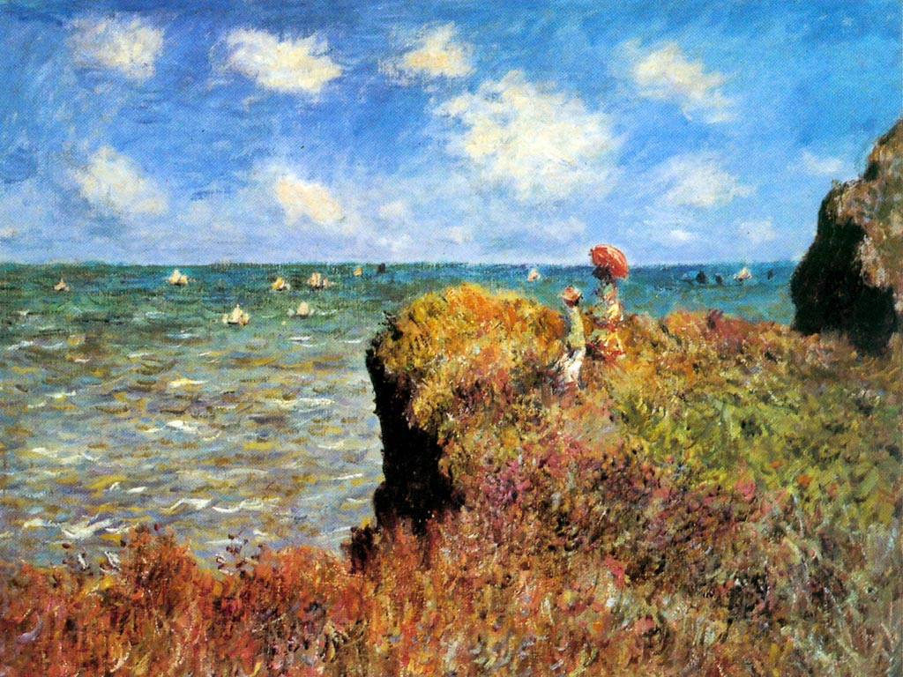

<html xmlns="http://www.w3.org/1999/xhtml">
<link href="stylePeinture.css" rel="stylesheet" type="text/css" />
<head>
<meta http-equiv="content-type" content="text/html;
					 charset=windows-1252" />
  <title>ISN - Des images</title>

   <link href="styleImage.css" rel="stylesheet" type="text/css"/>

</head>

<body>

<h1>Des tableaux de maitres</h1>

<h2>Ecole flamande</h2>

Pieter Brueghel ou Bruegel dit l'Ancien est un peintre brabançon né à Bruegel (près de Bréda) vers 1525 et mort le 9 septembre 1569 à Bruxelles.

Avec Jan Van Eyck, Jérôme Bosch et Pierre Paul Rubens, il est
  considéré comme une des quatre grandes figures de la peinture
  flamande. 

Tableaux de Brueghel l'Ancien

</img>
</img>
</img>

<h2>Impressionnisme</h2>

L'impressionnisme est un mouvement pictural français né de
  l'association de quelques artistes de la seconde moitié du XIXe
  siècle. Fortement critiqué à ses débuts, ce mouvement se manifesta
  notamment de 1874 à 1886 par huit expositions publiques à Paris, et
  marqua la rupture de l'art moderne avec
  l'académisme. L'impressionnisme est notamment caractérisé par une 
  tendance à noter les impressions fugitives, la mobilité des
  phénomènes climatiques, plutôt que l'aspect stable et conceptuel des
  choses, et à les reporter directement sur la
  toile. L'impressionnisme eut une grande influence sur l'art de cette
  époque, la peinture bien sûr, mais aussi la littérature et la
  musique.

Tableaux de Claude Monet

</img>
</img>
</img>

<h2>Fauvisme</h2>

Le fauvisme est un courant de peinture du début du XXe siècle. Tiré
d'une expression du journaliste Louis Vauxcelles, il débuta
historiquement à l'automne 1905, lors du Salon d'automne qui créa
scandale, pour s'achever moins de dix ans plus tard, au début des
années 1910. En fait, dès 1908, il est déjà à son crépuscule. Son
influence marqua néanmoins tout l'art du XXe siècle, notamment par la
libération de la couleur. Le précurseur du fauvisme était Henri
Matisse, mais d'autres artistes, comme André Derain, Maurice de
Vlaminck ou encore Georges Braque en ont fait partie.

Tableaux de Matisse

</img>
</img>
</img>

 

Textes issus de Wikipédia. 

</body>

</html>
